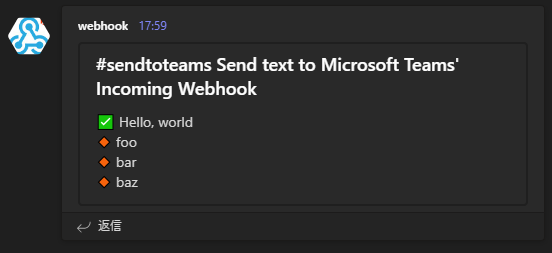

# teams-webhook: Microsoft Teams's incoming webhook interface

## Usage

`sendtoteams` sends some text to Microsoft Teams's Incoming Webhook.

Text is given by command line option `-t` or standard input.

Teams's webhook url must be given by command line option `-u url` or environment variable `TEAMS_WEBHOOK`.
(Webhook url is published in teams client. See [Create Incoming Webhooks](https://learn.microsoft.com/en-us/microsoftteams/platform/webhooks-and-connectors/how-to/add-incoming-webhook?tabs=dotnet))

`sendtoteams` prints http status code. The request is processed successfully when the code is `200`.

Some samples as below.

```
$ sendtoteams -t 'hello, world' -u http://url
200
$ echo hello, world | sendtoteams -u http://url
200
```

Samples using environment variable `TEAMS_WEBHOOK`.

```
$ export TEAMS_WEBHOOK=http://url
$ sendtoteams -t 'hello, world'
200
$ echo hello, world | sendtoteams
200
```

### Title line

`sendtoteams` recognizes the first line as a title when the first character is '#'. (tag in twitter)

For example:

* Source text
```
#sendtoteams Send text to Microsoft Teams' Incoming Webhook
✅ Hello, world
🔸 foo
🔸 bar
🔸 baz
```
* Teams' text



### Dry run

`sendtoteams --dry` executes the 'dry run', which prints the json only instead of sending it to Teams.

```
$ sendtoteams -t 'hello, world' -u http://url --dry
url=http://url
{
  "type": "message",
  "attachments": [
    {
      "contentType": "application/vnd.microsoft.teams.card.o365connector",
      "content": {
        "@type": "MessageCard",
        "@context": "https://schema.org/extensions",
        "title": "",
        "sections": [
          {
            "text": "hello, world"
          }
        ]
      }
    }
  ]
}
```

### Webhook selection

`sendtoteams` with `-n name` can select one by name in webhook url list which has semicolon separated list of named url as `name=url`, `alias=name` or `url`. For example, `-u` or `TEAMS_WEBHOOK="foo=http://foo;bar=http://bar;baz=foo;foo"` means (1) `foo` specifies http://foo, (2) `bar` specifies http://bar, (3) `baz` is an alias of foo (so `baz` specifies http://foo), and (4) `foo` is the default url.

`sendtoteams --list` prints list of the webhook selections.

```
$ TEAMS_WEBHOOK='foo=http://foo;bar=http://bar;baz=foo;foo' sendtoteams --list
foo: http://foo
bar: http://bar
baz: alias:foo
default: alias:foo
$ TEAMS_WEBHOOK='foo=http://foo;bar=http://bar;baz=foo;foo' sendtoteams --dry -n baz -t 'Hello, world'
url=http://foo
{
  "type": "message",
  "attachments": [
    {
      "contentType": "application/vnd.microsoft.teams.card.o365connector",
      "content": {
        "@type": "MessageCard",
        "@context": "https://schema.org/extensions",
        "title": "",
        "sections": [
          {
            "text": "Hello, world"
          }
        ]
      }
    }
  ]
}
```

## Install

```
pip3 install git+https://github.com/mkyutani/teams-webhook.git
```

## License

MIT License.
